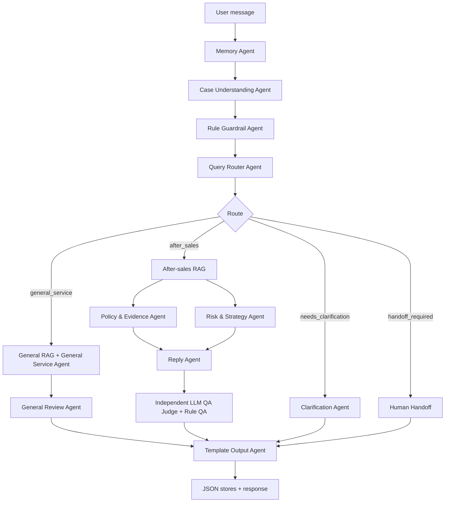

# AirBuds Pro X Agent Architecture

## Current Scope

The project is an AirBuds Pro X customer-service agent for one fixed product scenario.

In scope:

- General service questions: product specs, package contents, delivery, logistics, order basics.
- After-sales questions: quality issue, accessory missing, logistics damage, livestream promise dispute, refund-only request, platform after-sales process.
- Multi-turn clarification for vague cases.
- Traceable RAG, rerank, QA, and badcase records.
- JSON runtime storage.

Out of scope for now:

- Image evidence-chain analysis.
- Full ticket-management workflow.
- Automated acceptance suite as a product feature.

## Runtime Entry

`POST /api/chat` calls `runAgentGraph` in `lib/agent/orchestrator.ts`.

Input:

- `conversationId`
- `content`
- `images` kept only for backward-compatible API shape; image reasoning is disabled.
- `history`

Output:

- Final customer-visible message.
- Route decision.
- Agent node outputs.
- Trace events.
- Retrieval and QA details when applicable.

Trace records are stored in `data/traces.json`.

## Agent Flow

## Multi-Turn Clarification

Clarification state is stored through the Memory Adapter in `data/memories.json`.

The current behavior:

- The product is fixed to AirBuds Pro X, so clarification does not ask for generic product category.
- Recent user messages are merged when the previous turn asked for missing fields.
- Missing field diff is computed as:
  - `previousMissingFields`
  - `resolvedMissingFields`
  - `newMissingFields`
  - `missingFields`
- If a user provides enough new context, the route can move from `needs_clarification` to `general_service` or `after_sales`.
- If information remains unclear after one prior clarification turn, the second unclear turn is handed off to human support.

Current missing-field vocabulary:

- `具体问题`
- `处理诉求`

The trace page displays the missing-field change set.

## Branches

### General Service

Used for AirBuds Pro X ordinary questions:

- Active noise canceling
- Bluetooth and battery specs
- Package contents
- Delivery time
- Logistics/order basics

The agent retrieves from `knowledge/general/general-service-kb.json`, reranks, drafts an answer, and runs General Review.

### After Sales

Used for:

- Noise, one-side silent, malfunction
- Missing ear tips or accessories
- Package damage
- Livestream promise dispute
- Refund-only request
- Used/opened return consultation

The agent retrieves from `knowledge/rules/*.md`, builds policy evidence, computes risk strategy, drafts a reply, and runs both rule QA and independent LLM QA Judge.

### Clarification

Used only when the message is too vague to safely route.

It asks for only the still-missing fields and does not repeat fields that have been resolved.

### Handoff

Used for:

- Guardrail hard risk.
- Clarification loop exceeded.
- QA or template validation cannot produce a safe reply.

## RAG And Rerank

Knowledge index:

- Source: `knowledge/general/*.json` and `knowledge/rules/*.md`
- Built into `data/knowledge-index.json`
- Command: `npm run build:index`

Default vector store:

- `RAG_VECTOR_STORE=memory`
- This keeps retrieval in process and runtime data in JSON.

Optional vector store:

- LanceDB remains an adapter, but it is not the default storage choice.

Reranker:

- Local heuristic by default.
- BAAI cross-encoder through HTTP when `RAG_RERANKER=cross_encoder`.
- The local service is `scripts/baai-reranker-server.py`.

## LLMs

DeepSeek is used for:

- Case Understanding
- Query Router
- General Service Answer
- After-sales Reply Draft
- Independent QA Judge

Every DeepSeek call has deterministic fallback logic.

The QA Judge is independent from the drafting agent. A reply is sendable only when both rule QA and LLM QA pass.

## JSON Stores

Runtime stores:

- `data/memories.json`: conversation memory and clarification state.
- `data/traces.json`: full graph traces.
- `data/badcases.json`: manual and automatic badcase records.

Knowledge/index files:

- `data/demo-scenarios.json`
- `data/knowledge-index.json`
- `knowledge/general/general-service-kb.json`
- `knowledge/rules/*.md`

## Safety Rules

The system must not:

- Promise refund, compensation, reshipment, replacement, or final approval.
- Make final liability judgments.
- Ask users for photos, screenshots, image uploads, product pictures, or visual proof while image evidence-chain work is paused.
- Treat attachments as final facts.
- Answer after-sales disputes through the general-service branch.

## Main Files

- `lib/agent/orchestrator.ts`: agent graph and branch logic.
- `lib/llm/deepseek.ts`: DeepSeek structured-output adapter.
- `lib/rag/service.ts`: RAG orchestration.
- `lib/rag/vector-store.ts`: vector store adapters.
- `lib/rag/reranker.ts`: reranker adapters.
- `lib/store/*.ts`: JSON stores.
- `app/page.tsx`: operator console.
- `app/trace/page.tsx`: trace observability.
- `app/badcases/page.tsx`: badcase review.
