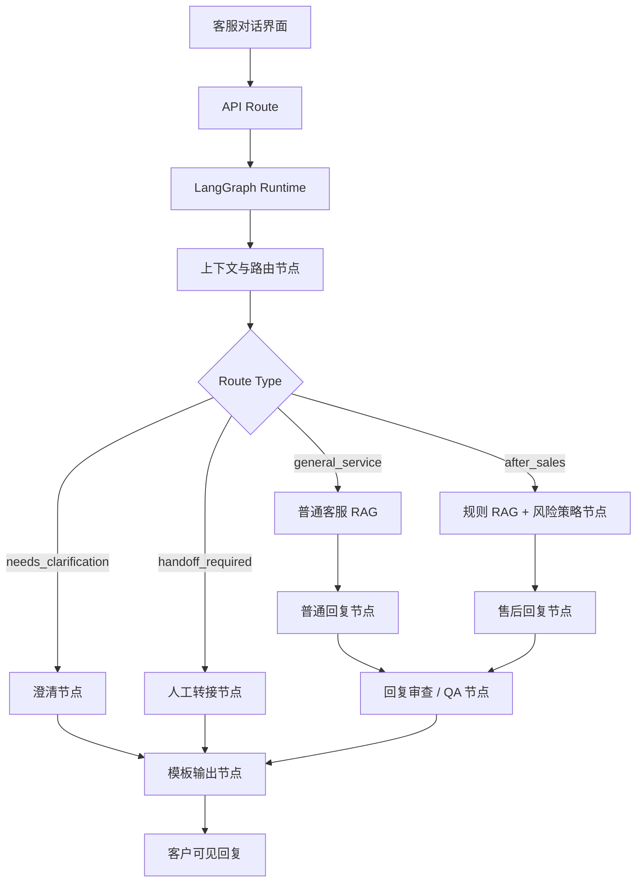

# AI-Powered Customer Service

AI-Powered Customer Service 是一个面向 3C 售后场景的智能客服 Agent 项目，当前以 AirBuds Pro X 为演示商品。项目使用 Next.js 构建客服界面，后台采用 LangGraph 风格的 Agent 编排流程，完成上下文理解、路由判断、知识检索、售后策略、回复生成、安全审查和最终输出。

项目目标是提供一个简洁可运行的客服对话系统：用户在前端输入问题，后台按既定 Agent 链路处理，并输出安全、克制、可追踪的客服回复。

## 核心能力

- 简洁客服对话界面，突出用户提问和客服回复。
- 上下文与路由节点识别普通咨询、售后处理、补充信息和人工转接。
- 普通知识库与售后规则库按路由隔离，避免不同业务口径互相污染。
- 售后链路覆盖质量问题、配件缺失、物流破损、仅退款、激活/拆封争议和直播承诺争议。
- 回复输出前进行安全审查，避免直接承诺退款、赔付、补发、审核通过或最终责任判定。
- 高风险或争议场景采用保守话术，并优先转人工继续处理。
- 后台保留路由、检索、节点摘要和最终状态，方便查看 Agent 执行过程。

## Agent 架构



整体流程保持保守：普通问题只从普通客服知识库回答；售后问题进入规则、风险策略、回复生成、QA 和模板输出链路；直播承诺、投诉升级、强争议等场景优先转人工，不在系统内直接给出处置承诺。

## Agent 可用工具

- `knowledge.retrieve`：检索商品规格、包装清单、订单基础信息、发货和物流等普通客服知识。
- `rule.retrieve`：检索退款、破损、质量、配件、激活、直播争议等售后规则。
- `example.retrieve`：为售后策略提供参考处理样例。
- `template.retrieve`：为最终回复提供客服话术模板。
- `llm.judge`：对草稿回复进行安全审查。
- `badcase.lookup`：查询已知风险模式，辅助避免重复输出问题话术。

## 本地运行

```powershell
npm install
Copy-Item .env.example .env.local
npm run build:index
npm run dev
```

默认访问地址：

```text
http://127.0.0.1:3000
```

如需调用 DeepSeek，请在 `.env.local` 中配置：

```text
DEEPSEEK_API_KEY=
DEEPSEEK_MODEL=deepseek-v4-flash
DEEPSEEK_API_BASE_URL=https://api.deepseek.com
```

如需使用本地确定性演示模式，可设置：

```text
DEEPSEEK_DISABLED=1
```

## 常用命令

```powershell
npm run dev          # 启动本地开发服务
npm run build        # 构建 Next.js 应用
npm run start        # 启动构建后的服务
npm run build:index  # 重建本地知识索引
```

可选 reranker 服务：

```powershell
npm run reranker:install
npm run reranker:start
```

## 目录结构

```text
app/                    Next.js 页面和 API routes
lib/agent/              Agent 编排、图节点、路由、QA 和模板逻辑
lib/rag/                检索、打分、规则读取和知识服务
knowledge/              普通客服知识与售后规则源文件
data/knowledge-index.json
                        生成后的本地知识索引
scripts/                索引构建、本地辅助脚本和服务脚本
docs/                   架构说明与开发文档
```

## 当前边界

- 当前项目是单一 3C 商品场景的智能客服演示，不是完整生产客服平台。
- 不连接真实订单、支付、退款、仓储、物流或 CRM 系统。
- 客户可见回复不得承诺退款、赔付、补发、审核通过或最终责任结论。
- 当前暂停图片证据链分析，优先基于文字描述、订单信息、平台记录和人工转接处理。
- 高风险或争议场景应使用保守话术，并转人工继续核实。
