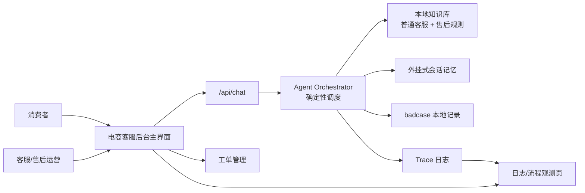
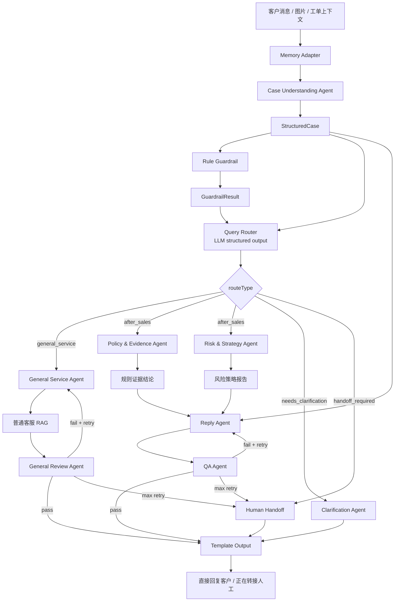
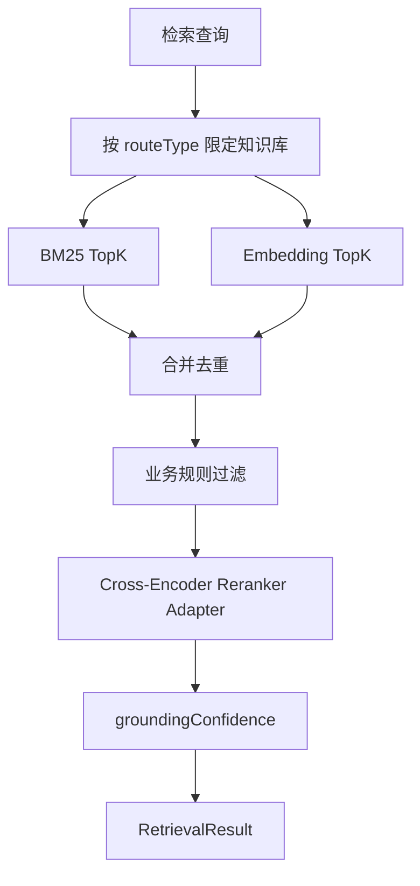

---
title: 内容电商 3C 售后智能客服 Agent 架构设计
status: aligned-draft
created: 2026-06-12
updated: 2026-06-13
workflowType: architecture
source_prd: ../prd-3c-after-sales-agent/prd.md
change_proposal: ../sprint-change-proposal-20260613-agent-runtime-alignment.md
---

# 架构设计：内容电商 3C 售后智能客服 Agent

## 1. 架构目标

第一版采用本地可运行的 Web 全栈 MVP，目标是在一个电商客服后台中跑通以下闭环：

客户消息/图片 -> 外挂式记忆注入 -> 案件结构化 -> 规则兜底 -> LLM 结构化路由 -> 普通客服或售后服务等分支处理 -> 审核/QA 循环 -> Template Output -> 直接回复客户或转人工。

架构必须支持：

1. 普通客服咨询和 3C 售后服务分流。
2. 本地 RAG 知识库，不接真实数据库。
3. 图片证据线索辅助判断，不做最终判责。
4. 高风险回复安全控制。
5. 独立日志/流程观测页。
6. badcase 沉淀。

## 2. 架构原则

1. Orchestrator 只做确定性调度，不做自由业务判断。
2. 每轮对话必须先结构化，再规则兜底，再路由。
3. Query Router 使用 LLM structured output，不使用 Embedding 相似性作为主路由。
4. RAG 用于普通知识和售后规则依据，不直接替代业务策略判断。
5. 所有客户可见输出必须经过审核/QA 与 Template Output。
6. 主界面是客服后台，不是 Agent 调试界面。
7. MVP 优先本地演示，但模块边界保留替换能力。

## 3. 技术形态

推荐实现：

- 前端：Next.js / React
- 后端：Next.js API Routes
- Agent 编排：TypeScript deterministic orchestrator
- 知识库：Markdown / JSON 本地文件
- RAG：BM25 + Embedding + business filter + reranker adapter
- 向量索引：LanceDB 默认，本地测试可切换 InMemoryVectorStore
- 图片识别：MVP 使用 mock 或多模态 adapter，输出 evidence clues
- 存储：本地 JSON / 文件型 demo store
- 日志：本地 trace event store

不接入：真实订单库、物流库、支付/赔付系统、真实客服工单系统、用户画像系统。

## 4. 系统上下文



## 5. Agent 运行框架



## 6. 核心模块

### 6.1 Web 客服后台

主界面职责：

- 展示客服对话窗口。
- 展示客户消息、图片、AI 回复、补充信息请求和转人工状态。
- 展示工单队列、状态、风险标签、来源平台和最近动作。
- 提供重新生成、标记 badcase、查看日志的入口。

主界面不默认展示：

- Agent trace。
- RAG TopK。
- prompt。
- QA 详细原因。
- 内部执行链路。

日志/流程观测页职责：

- 展示 StructuredCase。
- 展示 GuardrailResult。
- 展示 RouteDecision。
- 展示 RAG 检索、过滤、重排和 groundingConfidence。
- 展示审核/QA 循环、重写原因和转人工原因。
- 展示 Template Output 安全校验结果。
- 支持 badcase 复盘。

### 6.2 Agent Orchestrator

Orchestrator 是确定性调度器。它负责：

1. 固定执行顺序。
2. 分支选择。
3. 并行边界。
4. 审核循环。
5. 最大重写次数。
6. 自动回复和转人工终止。
7. Trace 事件写入。

Orchestrator 不负责：

1. 自由判断业务类型。
2. 自由解释售后规则。
3. 自由决定是否承诺退款或赔付。
4. 绕过审核直接输出客户可见回复。

### 6.3 Memory Adapter

职责：

- 读取当前会话记忆。
- 注入历史对话、已补充信息、已采取措施、已转人工状态和 badcase 标记。
- 写入本轮客户消息、系统动作、最终输出和人工兜底状态。
- 超过 7 天未更新时压缩为摘要记忆。
- 超过 30 天未更新时清除详细记忆。

### 6.4 Case Understanding Agent

输入：

- 客户文本。
- 图片线索。
- 工单上下文。
- Memory Adapter 注入的上下文。

输出：`StructuredCase`

关键字段：

- `productInfo`
- `issueSummary`
- `customerRequest`
- `evidenceState`
- `imageClues`
- `emotionState`
- `knownContext`
- `missingFields`
- `riskSignals`
- `priorActions`
- `clarificationQuestions`

### 6.5 Rule Guardrail

职责：

- 在 Query Router 前处理硬约束。
- 标记高风险和超范围信号。
- 生成禁止承诺项。
- 给出兜底约束和建议路由覆盖。

典型硬风险：

- 仅退款。
- 高额赔付。
- 激活后退货。
- 投诉威胁。
- 直播承诺争议。
- 图片与文本冲突。
- 规则依据不足。

### 6.6 Query Router

职责：

基于 StructuredCase 与 GuardrailResult 进行 LLM 结构化路由。

输出：

- `routeType`
- `confidence`
- `rationale`
- `requiredInfo`
- `riskSignals`
- `guardrailApplied`
- `targetFlow`

routeType：

1. `general_service`
2. `after_sales`
3. `needs_clarification`
4. `handoff_required`

Embedding 只用于 RAG 召回，不用于主路由决策。

### 6.7 General Service Branch

执行顺序：

1. General Service Agent 根据 StructuredCase 构造检索查询。
2. 只检索普通客服知识库。
3. RAG 返回产品规格、包装清单、发货时效、快递公司、快递单号示例或订单基础状态等演示知识。
4. General Service Agent 生成候选回复。
5. General Review Agent 审核是否编造事实、是否误触售后承诺、是否需要转售后或人工。
6. 审核通过进入 Template Output。
7. 审核失败且未超限则重写。
8. 超过最大次数进入 Human Handoff。

### 6.8 After-Sales Branch

执行顺序：

1. Policy & Evidence Agent 检索售后规则库，输出规则证据结论。
2. Risk & Strategy Agent 同时评估风险等级、策略建议、禁止承诺项和是否需要转人工。
3. Reply Agent 基于 StructuredCase、规则证据结论、风险策略报告和记忆生成候选回复。
4. QA Agent 独立审核候选回复。
5. QA 通过进入 Template Output。
6. QA 不通过且未超限则附带原因要求 Reply Agent 重写。
7. 超过最大次数进入 Human Handoff。

### 6.9 Clarification Branch

当 routeType 为 `needs_clarification` 时：

- Clarification Agent 输出补充信息问题。
- 不输出业务结论。
- 客户补充后重新执行 Memory Adapter、Case Understanding、Rule Guardrail 和 Query Router。

### 6.10 Human Handoff Branch

当 routeType 为 `handoff_required` 或审核循环超限时：

- 输出“正在转接人工”或同等含义状态。
- 不输出未经审核的业务结论。
- 写入 handoff reason。

### 6.11 Template Output

职责：

- 根据 routeType 选择模板。
- 做最终安全检查。
- 输出客户可见消息或转人工状态。

模板类型：

1. 普通客服回答模板。
2. 售后服务回答模板。
3. 补充信息模板。
4. 转人工模板。

安全检查：

- 禁用承诺。
- 最终判责。
- 图片线索误表述。
- 语气风险。
- 空回复。
- 字段缺失。
- 格式错误。

## 7. RAG 架构

### 7.1 知识库划分

```text
knowledge/
  general/
    product-specs.md
    shipping-faq.md
    courier-faq.md
    order-status-samples.md
    platform-service-policy.md
  rules/
    platform-after-sales.md
    c3c-activation-return.md
    quality-issue.md
    accessory-missing.md
    logistics-damage.md
    livestream-promise.md
    refund-only.md
```

### 7.2 检索重排流程



### 7.3 Reranker 策略

默认目标算法：BM25 关键词召回 + Embedding 向量召回 + 业务规则过滤 + Cross-Encoder 重排序。

MVP 可使用 mock reranker adapter：

- 关键词命中权重。
- 意图/category 匹配。
- 商品类目匹配。
- 风险标签匹配。
- 简单语义相似度分数。

接口必须保留替换真实 Cross-Encoder 的能力。

### 7.4 VectorStore

默认：LanceDB。

备用：InMemoryVectorStore。

封装接口：

- `upsertChunks(chunks)`
- `searchEmbedding(queryEmbedding, topK, filter)`
- `deleteBySource(sourceId)`
- `rebuildIndex(chunks)`

约束：

- 不保存真实用户隐私。
- 不保存真实订单或真实物流数据。
- 只保存知识库切片、向量、标题、来源、category、metadata 和更新时间。

## 8. 数据模型

```ts
export type RouteType =
  | "general_service"
  | "after_sales"
  | "needs_clarification"
  | "handoff_required";

export interface StructuredCase {
  caseId: string;
  conversationId: string;
  productInfo?: string;
  issueSummary: string;
  customerRequest?: string;
  evidenceState: string;
  imageClues: string[];
  emotionState: "calm" | "anxious" | "angry" | "complaint";
  knownContext: string[];
  missingFields: string[];
  riskSignals: string[];
  priorActions: string[];
  clarificationQuestions: string[];
}

export interface GuardrailResult {
  hardRiskFlags: string[];
  outOfScope: boolean;
  prohibitedCommitments: string[];
  fallbackConstraints: string[];
  recommendedRouteOverride?: RouteType;
  rationale: string;
}

export interface RouteDecision {
  routeType: RouteType;
  confidence: number;
  rationale: string;
  requiredInfo: string[];
  riskSignals: string[];
  guardrailApplied: boolean;
  targetFlow: string;
}

export interface RetrievalResult {
  knowledgeBase: "general" | "after_sales";
  bm25Candidates: RetrievalCandidate[];
  embeddingCandidates: RetrievalCandidate[];
  filteredCandidates: RetrievalCandidate[];
  rerankedTopK: RetrievalCandidate[];
  groundingConfidence: number;
  insufficientGrounding: boolean;
}

export interface ReviewResult {
  passed: boolean;
  reasons: string[];
  rewriteInstructions: string[];
  riskFlags: string[];
  attempt: number;
}

export interface TemplateOutputResult {
  visibleStatus: "sent" | "needs_clarification" | "handoff";
  finalMessage: string;
  templateType: "general" | "after_sales" | "clarification" | "handoff";
  safetyChecks: string[];
  handoffReason?: string;
}
```

## 9. API 设计

### POST `/api/chat`

请求：

```json
{
  "conversationId": "conv_001",
  "ticketId": "ticket_001",
  "message": "耳机用了两天有杂音，我要退款",
  "images": [],
  "selectedScenarioId": "quality_refund"
}
```

响应：

```json
{
  "conversationId": "conv_001",
  "ticketId": "ticket_001",
  "visibleStatus": "sent",
  "finalMessage": "理解您的情况...",
  "routeDecision": {
    "routeType": "after_sales",
    "confidence": 0.88
  },
  "ticketStatus": "processing",
  "traceId": "trace_001"
}
```

### GET `/api/scenarios`

返回本地演示场景。

### POST `/api/badcases`

记录 badcase。

### GET `/api/rules`

用于日志页或演示调试查看本地规则库条目。

## 10. Trace 事件

每轮处理至少记录：

1. `memory.loaded`
2. `case.structured`
3. `guardrail.checked`
4. `router.decided`
5. `rag.retrieved`
6. `branch.generated`
7. `review.completed` 或 `qa.completed`
8. `template.validated`
9. `message.sent` 或 `handoff.started`
10. `badcase.marked`

## 11. 安全与合规约束

禁止输出：

- “一定可以退款”
- “可以直接赔付”
- “已经确认是物流责任”
- “已确认商品损坏”
- “无需退货直接退款”
- “平台一定会补发”

建议表达：

- “需要进一步核实”
- “以平台审核结果为准”
- “根据您提供的信息，当前疑似存在……”
- “建议您补充……”
- “正在为您转接人工继续处理”

## 12. 实施顺序建议

1. 统一类型和 demo 数据。
2. 实现主界面：客服对话窗口 + 工单管理。
3. 实现 Agent Orchestrator 状态骨架。
4. 实现 Memory、Case Understanding、Rule Guardrail、Query Router mock。
5. 实现普通客服分支和售后服务分支 mock。
6. 实现 RAG adapter、VectorStore adapter 和 reranker adapter。
7. 实现审核/QA 循环和 Template Output。
8. 实现日志/流程观测页和 badcase。
9. 跑通端到端 demo 场景。
